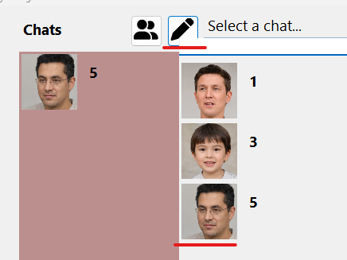
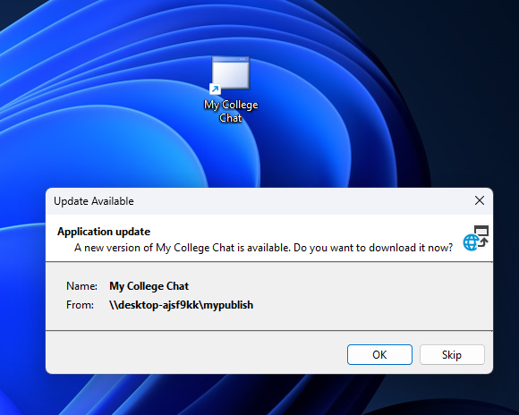

## Start app

There are three projects in this solution:

1. MainApp - This is the core application containing the majority of the codebase.
2. Starter1 - This project acts as a lightweight client to initialize and launch instances of MainApp with a specific user.
3. Starter2 - same as Starter1.

Running MainApp directly will prompt for login/registration.

The purpose of the Starter projects is to enable multiple MainApp
clients to start up in parallel, each initialized with a distinct user.
The code in the Starter projects is minimal - it simply loads and starts
MainApp with a predefined user.

To set what user to run, open the StarterX-\Program.cs file and set the
"RunUser" parameter to the nickname of the user you want the project to
run as.

To run the two Starter projects concurrently, you can configure the
solution as shown in the pictures below. This allows Starter1 and
Starter2 to launch separate MainApp instances simultaneously from a
single solution, with each instance loading a different user. (Press F5
to debug...)

In this flow, we assume you have registered 2 users with the nicknames
\"1\" and \"2\".

Let\'s start:

## Login

If the user does not exist, they will be added to the users collection
in MongoDB.

## Edit profile

To update the profile image, right-click on the profile icon in the
bottom left corner to open the profile dialog. Click on the second
profile image to select a new photo from your local files. This will
copy the selected image file to the profile image location in Windows
and update the file reference for the profile image in the database\'s
user collection. After clicking OK in the dialog, the new profile
image will be displayed.

## To start a new personal chat with another user

1.  Click the pencil icon to open the message composition interface.

2.  Select a recipient from the user list to begin a new chat thread.

This will create a new chat entity in the chats collection in the
database. Any messages sent or received later will be associated with
the chat entity.

## Sending a Message

To send a personal or group message:

1.  Type your message in the text box.

2.  Click the Send button to deliver your message to the recipient(s).

This will:

1.  Add a new message document to the database containing the message
    text.

2.  Update the relevant chat entity in the chats collection with a
    preview snippet of the message.

## Starting a New Group Chat

To initiate a new group chat:

1.  Click the group icon to open the create group chat dialog.

2.  Enter a name for the new group chat.

3.  Click OK to confirm creation of the group.

This will create a new chat entity in the database, similarly to
starting a regular chat. The difference is that the chat type will be
set to \"Group\" instead of \"User\".

## A demo with a personal chat and a group 🙂

# Let\'s publish

Sharing a folder provides a UNC path that can be used later. Let\'s
share a folder so that published content will be accessible there.

After sharing a folder, the full UNC path is visible. Let\'s save that
path for use soon when publishing.

Now that we\'ve shared a folder, we can return to Visual Studio and
publish.

The shared folder will be our publish target.

Let\'s use the UNC path that we previously extracted as the publish
location.

again...

The product name will be used as the name for the desktop shortcut.

A new shortcut for the product will appear on the desktop after
publishing

If a new version is published later, a prompt will appear when launching
to try to update.

